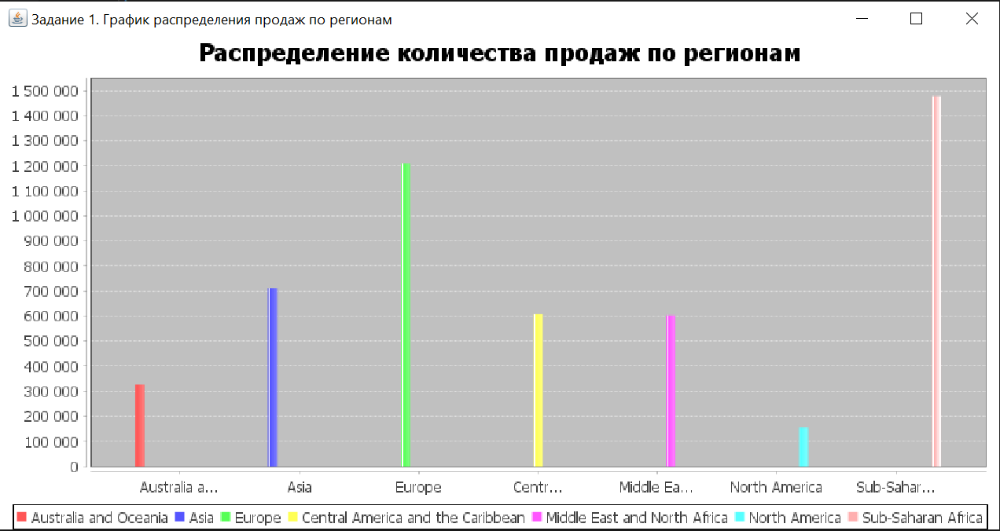
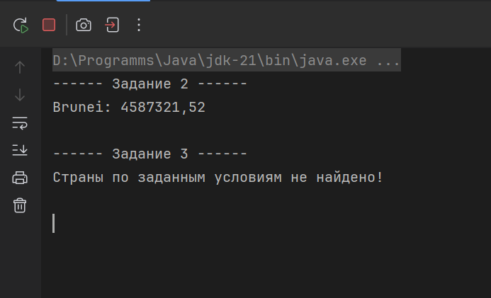

# Семестровый проект по Java. 
Вариант 6.
## Технологии

- **Java 21** - язык программирования
- **Maven** - система сборки проекта
- **SQLite** - база данных для хранения нормализованных данных
- **OpenCSV** - библиотека для парсинга CSV-файлов
- **JFreeChart** - библиотека для создания графиков и диаграмм
- **JUnit 5** - фреймворк для тестирования

## Структура проекта

```
selling-products-worldwide/
├── src/
│   ├── main/
│   │   ├── java/by/r0manb/
│   │   │   ├── Main.java              # Точка входа в приложение
│   │   │   ├── Tasks.java             # Реализация заданий по варианту
│   │   │   ├── config/
│   │   │   │   └── DbConfig.java      # Конфигурация подключения к БД
│   │   │   ├── dao/                   # Data Access Objects для работы с БД
│   │   │   │   ├── CountryDao.java
│   │   │   │   ├── ItemTypeDao.java
│   │   │   │   ├── OrderDao.java
│   │   │   │   ├── OrderPrioritiesDao.java
│   │   │   │   ├── RegionDao.java
│   │   │   │   └── SalesChannelDao.java
│   │   │   ├── db/                    # Работа с базой данных
│   │   │   │   ├── Database.java      # Интерфейс для работы с БД
│   │   │   │   └── SQLiteDatabase.java # Реализация для SQLite
│   │   │   ├── model/
│   │   │   │   └── Order.java         # Модель данных заказа
│   │   │   └── util/                  # Утилиты
│   │   │       ├── CsvParser.java     # Парсер CSV-файлов
│   │   │       └── DateParser.java    # Парсер дат
│   │   └── resources/
│   │       ├── data.csv               # Исходные данные
│   │       └── db.properties          # Настройки подключения к БД
│   └── test/
│       └── java/                      # Тесты
├── doc/
│   └── images/                        # Скриншоты результатов
│       ├── task_1.png
│       └── task_2_3.png
├── pom.xml                            # Конфигурация Maven
└── README.md                          # Документация проекта
```

## Последовательность работы по проекту

### 1. Разработка модели данных

Создан класс `Order` для представления данных о заказе со следующими полями:
- `region` - регион
- `country` - страна
- `itemType` - тип товара
- `salesChannel` - канал продажи
- `orderPriority` - приоритет заказа
- `orderDate` - дата заказа
- `unitsSold` - количество проданных единиц
- `totalProfit` - общая прибыль

### 2. Парсинг CSV-файла

Реализован класс `CsvParser`, преобразущий строки CSV-файла в список объектов `Order`

### 3. Проектирование базы данных

Спроектирована нормализованная схема БД в соответствии с 3-й нормальной формой:

#### Таблица `regions`
- `id` (INTEGER PRIMARY KEY) - уникальный идентификатор региона
- `name` (TEXT NOT NULL UNIQUE) - название региона

#### Таблица `countries`
- `id` (INTEGER PRIMARY KEY) - уникальный идентификатор страны
- `name` (TEXT NOT NULL UNIQUE) - название страны
- `region_id` (INTEGER REFERENCES regions(id)) - ссылка на регион

#### Таблица `item_types`
- `id` (INTEGER PRIMARY KEY) - уникальный идентификатор типа товара
- `name` (TEXT NOT NULL UNIQUE) - название типа товара

#### Таблица `sales_channels`
- `id` (INTEGER PRIMARY KEY) - уникальный идентификатор канала продажи
- `name` (TEXT NOT NULL UNIQUE) - название канала продажи

#### Таблица `order_priorities`
- `id` (INTEGER PRIMARY KEY) - уникальный идентификатор приоритета
- `name` (TEXT NOT NULL UNIQUE) - название приоритета

#### Таблица `orders`
- `id` (INTEGER PRIMARY KEY) - уникальный идентификатор заказа
- `country_id` (INTEGER REFERENCES countries(id)) - ссылка на страну
- `item_type_id` (INTEGER REFERENCES item_types(id)) - ссылка на тип товара
- `sales_channel_id` (INTEGER REFERENCES sales_channels(id)) - ссылка на канал продажи
- `priority_id` (INTEGER REFERENCES order_priorities(id)) - ссылка на приоритет
- `order_date` (TEXT NOT NULL) - дата заказа
- `units_sold` (INTEGER NOT NULL) - количество проданных единиц
- `total_profit` (REAL NOT NULL) - общая прибыль

### 4. Создание базы данных SQLite

Реализован класс `SQLiteDatabase`, который:
- Создает подключение к базе данных SQLite
- Создает все необходимые таблицы через метод `createTables()`

### 5. Сохранение данных в БД

Реализованы DAO-классы для работы с каждой таблицей:
- `RegionDao` - работа с регионами
- `CountryDao` - работа со странами
- `ItemTypeDao` - работа с типами товаров
- `SalesChannelDao` - работа с каналами продажи
- `OrderPrioritiesDao` - работа с приоритетами заказов
- `OrderDao` - работа с заказами

Каждый DAO содержит методы `getIdOrCreate()` для получения существующей записи или создания новой, обеспечивая нормализацию данных и избежание дублирования.

### 6. Реализация SQL-запросов

Реализованы три задания согласно варианту 6:

#### Задание 1: График по общему количеству проданных товаров по регионам

**SQL-запрос:**
```sql
SELECT
    r.name,
    SUM(o.units_sold) as total_units
FROM regions r
LEFT JOIN countries c ON r.id = c.region_id
LEFT JOIN orders o ON c.id = o.country_id
GROUP BY r.name;
```

Метод `task1()` выполняет запрос, собирает данные и создает столбчатую диаграмму с помощью JFreeChart.

#### Задание 2: Страна с самым высоким общим доходом среди регионов Европы и Азии

**SQL-запрос:**
```sql
SELECT
    c.name,
    SUM(o.total_profit) as total_sum
FROM countries c
LEFT JOIN regions r ON c.region_id = r.id
LEFT JOIN orders o ON c.id = o.country_id
WHERE r.name IN ('Asia', 'Europe')
GROUP BY c.name
ORDER BY total_sum DESC
LIMIT 1;
```

Метод `task2()` выполняет запрос и выводит результат в консоль.

#### Задание 3: Страна с доходом от 420 до 440 тыс в регионах Ближний Восток и Северная Африка и Субсахарская Африка

**SQL-запрос:**
```sql
SELECT
    c.name,
    SUM(o.total_profit) as total_sum
FROM countries c
LEFT JOIN regions r ON c.region_id = r.id
LEFT JOIN orders o ON c.id = o.country_id
WHERE r.name IN ('Middle East and North Africa', 'Sub-Saharan Africa')
GROUP BY c.name
HAVING total_sum BETWEEN 420000 AND 440000
ORDER BY total_sum DESC
LIMIT 1;
```

Метод `task3()` выполняет запрос и выводит результат в консоль. Если страна не найдена, выводится соответствующее сообщение.

### 8. Визуализация данных

Для визуализации используется библиотека JFreeChart. 

Столбчатая диаграмма для задания 1 отображается в отдельном окне Swing


## Результаты выполнения заданий

### Задание 1: График распределения продаж по регионам



График показывает общее количество проданных товаров, сгруппированных по регионам.

### Задание 2 и 3: Результаты SQL-запросов



В консоли выводятся результаты выполнения заданий 2 и 3:
- **Задание 2:** Страна с самым высоким доходом среди регионов Европы и Азии
- **Задание 3:** Страна с доходом от 420 до 440 тыс в указанных регионах

## Тестирование

Проект включает unit-тесты:
- `DateParserTest` - тестирование парсинга дат
- `CsvToDatabaseConsistencyTest` - проверка консистентности данных между CSV и БД


## Лицензия
Проект создан в учебных целях.
